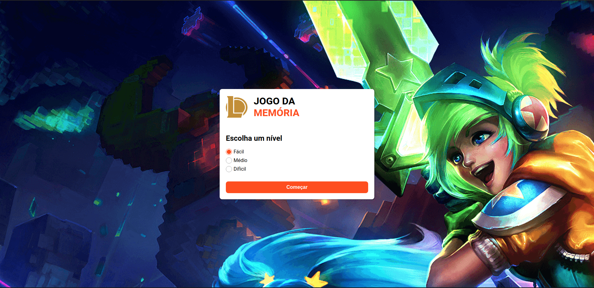

# Jogo da memória do League of Legends

## 


## :page_facing_up: Sumário

- :bulb: [Sobre](#sobre)
- :computer: [Tecnologias](#techs)
- :rocket: [Como rodar a aplicação](#how-to-run)

<h2 id="sobre">
    :bulb: Sobre
</h2>

Aplicação web feita para simular um jogo da memória com os campeões do League of Legends.

A versão live do mesmo está disponível [aqui](https://league-of-legends-memory-game.vercel.app/)

<h2 id="techs">
    :computer: Tecnologias
</h2>

- React
  - Context API
  - React Hooks
- Styled-Components
- TypeScript
- Polished

<h2 id="how-to-run">
    :rocket: Como rodar a aplicação
</h2>

**Requisitos**

- Yarn

**Clone o repositório**

```
git@github.com:liverday/league-of-legends-memory-game.git
```

**Instale as dependências**

```
cd league-of-legends-memory-game
yarn
```

**Inicie o processo**

```
yarn start
```

Feito com :heart: por Vitor Medeiro. 🤝 Entre em [contato](https://www.linkedin.com/in/vitor-medeiro-9096ab138)
